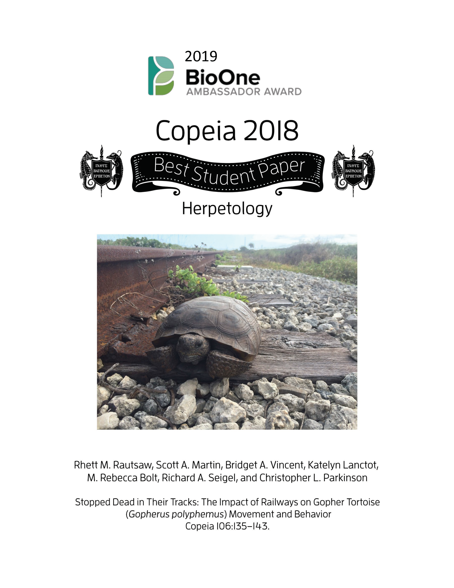

```{r, include=FALSE}
knitr::opts_chunk$set(
  results='asis', 
  echo = FALSE
)

library(magrittr) # For the pipe
library(scholar)
library(ggpubr)
library(dplyr)
source("cv_printing_functions.r")

# Read in all data and initialize a CV printer object
CV <- create_CV_object(
  data_location = "https://docs.google.com/spreadsheets/d/1Zb7IH35H1FJBA-CxHxuqwfqh-cS-Z5cSdTkDFBs53WE",  
  pdf_mode = params$pdf_mode
)

```


```{r}
# When in pdf export mode the little dots are unaligned, so fix that with some conditional CSS.
if(params$pdf_mode) {
    cat("
<style>
:root{
  --decorator-outer-offset-left: -6.5px;
}
</style>")
}
```


Aside
================================================================================

```{r}
# Build interactive network of positions colored by section
# and connected if they occurred in the same year
#datadrivencv::build_network_logo(CV$entries_data)
#<center></center>
```

<center>{width=30%}</center>

```{r}
if(params$pdf_mode){
  cat("View this CV online with links at https://github.com/RhettRautsaw/CV")
} else {
  cat("[<i class='fas fa-download'></i> Download a PDF of this CV](https://github.com/RhettRautsaw/CV/raw/master/rautsaw_cv.pdf)")
}
```

Contact {#contact}
--------------------------------------------------------------------------------

```{r}
CV %>% print_contact_info()
```


Language Skills {#skills}
--------------------------------------------------------------------------------

```{r}
CV %>% print_skill_bars()
```


Disclaimer {#disclaimer}
--------------------------------------------------------------------------------

The source code is available on [github.com/RhettRautsaw/CV](https://github.com/RhettRautsaw/CV).

Last updated `r format(Sys.Date(), format = "%B %Y")`.


Main
================================================================================

Rhett M. Rautsaw {#title}
--------------------------------------------------------------------------------
#### Ph.D. Student, Clemson University
#### Evolution | Ecology | Conservation

```{r,eval=F}
# Note the special double pipe so we modify the CV object in place
CV %<>% print_text_block("intro") 
```


Education {data-icon=graduation-cap data-concise=true}
--------------------------------------------------------------------------------

```{r}
CV %<>% print_section('education')
```


Professional Experience {data-icon=suitcase}
--------------------------------------------------------------------------------

```{r}
CV %<>% print_section('experience')
```


Fellowships & Grants {data-icon=money}
--------------------------------------------------------------------------------
::: aside
```{r, warning=F}
#CV %<>% print_text_block('fellowships_grants_aside')
invisible(total_grant_monies<-CV$entries_data %>% filter(section=="fellowships_grants") %>% select(institution))
invisible(total_grant_monies$institution<-as.numeric(gsub("[\\$,]", "", total_grant_monies$institution)))
invisible(total_grant_monies<-as.numeric(sum(total_grant_monies$institution,na.rm=T)))
```
**Total:** $`r format(total_grant_monies, big.mark=",", small.mark=".", nsmall=2, digits=2)`
:::

```{r}
CV %<>% print_section('fellowships_grants')
```

<!-- These breaks just force a new page so section doesnt get cut off -->
<!--br-->
<!--br-->
<!--br-->

Awards & Honors {data-icon=trophy}
--------------------------------------------------------------------------------
::: aside
```{r, warning=F}
#CV %<>% print_text_block('awards_honors_aside')
invisible(total_grant_monies<-CV$entries_data %>% filter(section=="awards_honors") %>% select(institution))
invisible(total_grant_monies$institution<-as.numeric(gsub("[\\$,]", "", total_grant_monies$institution)))
invisible(total_grant_monies<-as.numeric(sum(total_grant_monies$institution,na.rm=T)))
```
**Total:** $`r format(total_grant_monies, big.mark=",", small.mark=".", nsmall=2, digits=2)`
:::

```{r}
CV %<>% print_section('awards_honors')
```

Publications {data-icon=book}
--------------------------------------------------------------------------------
::: aside
```{r}
CV %<>% print_text_block('pubs_peer_review_aside')
```

```{r}
invisible(pubs<-as.numeric(CV$entries_data %>% filter(section=="pubs_peer_review") %>% count()))
first_author<-CV$entries_data %>% filter(section=="pubs_peer_review") %>% select(description_bullets)
first_author$description_bullets<-gsub("- ","",first_author$description_bullets)
first_author<-gsub("<b>","", first_author$description_bullets)
first_author<-as.numeric(sum(grepl("^Rautsaw",first_author)))
gs<-scholar::get_profile("vL483VkAAAAJ")
```

|                      |                      |
|:---------------------|---------------------:|
|**Publications**      |`r pubs`              |
|**First Author**      |`r first_author`      |
|**Citations**         |`r gs$total_cites`    |
|**h-index**           |`r gs$h_index`        |
|**i10-index**         |`r gs$i10_index`      |

```{r, fig.width=6, fig.height=5}
ch<-scholar::get_citation_history("vL483VkAAAAJ")
ch_p<-ggbarplot(ch, "year","cites", fill="gray", xlab="", ylab="Citations", width=0.9) + theme_pubclean()
ggpar(ch_p, font.y=c(20,"bold"), font.tickslab=c(20,"bold"))
```

<center>.jpg){width=75%}</center>

<center>.png){width=75%}</center>

<center>{width=75%}</center>

:::

```{r}
CV %<>% print_section('pubs_peer_review')
```


Selected Press (About)  {data-icon=newspaper}
--------------------------------------------------------------------------------

```{r}
CV %<>% print_section('about_me_press')
```


<br>
<br>


Selected Press (By)  {data-icon=newspaper}
--------------------------------------------------------------------------------

```{r}
CV %<>% print_section('by_me_press')
```


Selected Publications, Posters, and Talks {data-icon=book}
--------------------------------------------------------------------------------

```{r}
CV %<>% print_section('academic_articles')
```


```{r}
CV %<>% print_links()
```

